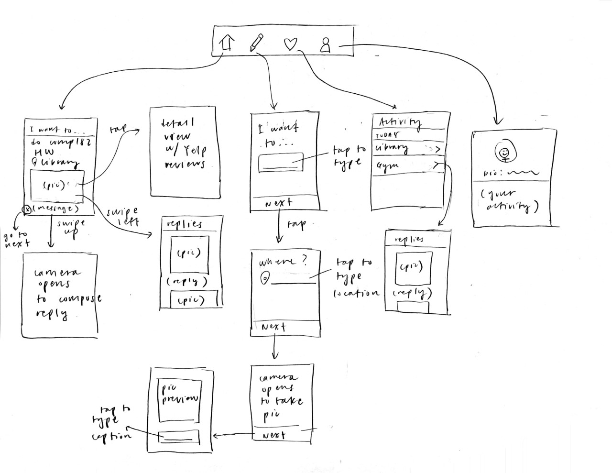

# "intandem"

Original App Design Project - README Template
===

## Buddy Finding App

## Table of Contents
1. [Overview]
1. [Product Spec](#Product-Spec)
1. [Wireframes](#Wireframes)
2. [Schema](#Schema)

## Overview
### Description
Through pictures & swipes, users can easily find people to go somewhere/do something with so they don't have to go alone (rather, **in tandem** with their friends).

### App Evaluation
[Evaluation of your app across the following attributes]
- **Category:** Social
- **Mobile:** Easy access
- **Story:** Allows users to easily find buddies to go somewhere/do something with so they don't have to go alone.
- **Market:** Everyone!
- **Habit:** Users can use app anytime they're bored or want to find another person to do something with.
- **Scope:** All places

## Product Spec

### 1. User Stories (Required and Optional)

**Required Must-have Stories**

* User can login, signup, and logout
* Users can add friends
  * Users can only interact with their friends on this app
* Users can create & post event invitations so that their friends can join them if they want
  * These posts include:
    * Location: e.g. Fondren Library
    * Time/Date: e.g. right now!
    * Picture: e.g. (picture of homework at the library)
    * Message: e.g. "please join me at the library i'm working on comp182 hw rn T_T"
* Users can view event invitations created by their friends in their home page
  * These posted events will be accompanied by Yelp & Google reviews (combine them?)
* Users can reply to posted event invitations by swiping up
  * Replies will consist of:
    * picture: e.g. (selfie showing excitement)
    * message: e.g. "omg i'm doing comp182 hw rn too i will join u"
  * Everyone who is invited to this post can see the replies
* Users can view people's replies to the event invitation they posted
* Users can create custom, very specific locations that are not available on the Google Places API
  * e.g. Martel Library at Rice University
  * these custom locations will be stored in a database

**Optional Nice-to-have Stories**

* Users can create smaller circles among their friends
  * e.g. "comp182 study group"; "hiking group"
* Users can filter invitations through a series of parameters, like location and date/time.
* Event invitations that are similar to ones that were replied to/interacted with before will be prioritized by being bubbled up to the top of the swiping queue.

### 2. Screen Archetypes

* Login/Signup screen
   * user can login/signup
* Event invitation screen (aka Home screen)
   * Users can view the invitations they have received
* Event detail screen
   * Users can see the details of an event, including reviews of the location
* Invitation creation screen
   * Users can create their event invitation here to share with their friends
* Activity screen
   * Users can view the replies they've gotten on their invitations
* Profile screen
   * includes profile picture and invitations they've created + replied to.

### 3. Navigation

**Tab Navigation** (Tab to Screen)

* Event invitation screen
* Create invitation screen
* Activity screen
* Profile screen

**Flow Navigation** (Screen to Screen)

* Invitation (on Home screen) -> (tap) invitation details
* Invitation (on Home screen) -> (swipe) replies to your friend's invitation 
* Invitation (on Activity page) -> (tap) replies to your invtation

## Wireframes
[Add picture of your hand sketched wireframes in this section]

### [BONUS] Digital Wireframes & Mockups

### [BONUS] Interactive Prototype

## Schema
### Models

New Place:

| Property | Type | Description |
| -------- | ------ | --------------------------- |
| objectId | String | unique id for the user post |
| name | String | name for the user place |
| location | JSON Object | location of the place |

Invitation:

| Property | Type | Description |
| -------- | ------ | --------------------------- |
| objectId | String | unique id for the user invitation |
| author | Pointer to User | invitation author |
| picture | File | picture accompanying the invitation |
| caption | String | invitation caption by author |
| location | JSON Object | location that this event will take place |
| time | DateTime | date/time that this event will take place |
| reviews | Pointer | pointer to review object |

Reply:

| Property | Type | Description |
| -------- | ------ | --------------------------- |
| objectId | String | unique id for the reply |
| author | Pointer to User | author of this reply |
| picture | File | picture for this reply |
| message | String | message for this reply |
| invitation | Pointer to Invitation | invitation that this reply is replying to |

Review: 

| Property | Type | Description |
| -------- | ------ | --------------------------- |
| objectId | String | unique id for the reviews |
| invitation | Pointer to Invitation | invitation that this review corresponds to
| Yelp reviews | ? | ? |
| Google reviews | ? | ? |

User:

| Property | Type | Description |
| -------- | ------ | --------------------------- |
| objectId | String | unique id for the user |
| username | String | user's username |
| password | String | user's password |
| bio | String | user's bio |
| profilePic | File | image that is the user's profile pic |

Friendships:

| Property | Type | Description |
| -------- | ------ | --------------------------- |
| user1 | Pointer to User | one side of friendship |
| user2 | Pointer to User | other end of friendship |

### Networking
List of network requests by screen
* Home Screen
   * (Read/GET) Query all invitations created by the user's friends
      * query = PFQuery("Invitation");
        query.whereKey("author", currentUser.getFriends())
        query.order(byDescending: "createdAt")
        query.findObjectsInBackground(e) {
           if e != null { 
              System.out.println("error in fetching invitations");
              return;
           } else {
              System.out.println("Successfully fetched invitations");
          // TODO: Do something with posts...
           }
        }
   * (Create/POST) Create a new invitation reply
* Create Invitation Screen
   * (Create/POST) Create a new invitation
* Profile Screen
   * (Read/GET) Query logged in user object
   * (Update/PUT) Update user profile image/bio
  
- [Create basic snippets for each Parse network request]
- [OPTIONAL: List endpoints if using existing API such as Yelp]

Google Places SDK

| HTTP Verb | Endpoint | Description
| --------- | -------- | ------------|
| GET | /place/details/json | gets the details of the specified place |
